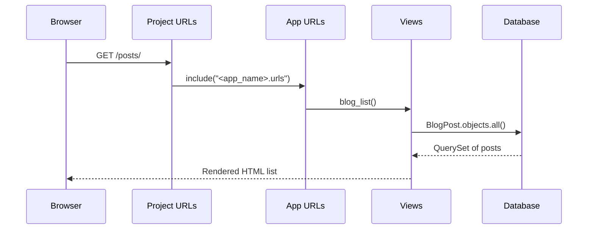

# Issue 7 – Show Your Data on the Page

This issue teaches you how to **take data from your Django database and display it on a real web page**.  
You will also learn how to **create your Issue 7 branch**, **commit your work**, and **open a Pull Request** so the Quest checker can run.

You can build **any project idea** you want — tasks, recipes, notes, products — but the example below uses a **BlogPost** model so you can clearly follow along.
---

## 🧭 What You Have So Far

You already built:

- A Django project & App
- A `BlogPost` model (or your own model)  
- A database and migrations  
- A Django admin panel with superuser created
- A working homepage  

Now you will:

- Add sample data  
- Query your model in a view  
- Render it on a webpage using a template  
- Use a new Issue 7 branch that the checker can detect  

---

# 🔄 0. Update `main` and Create Your Issue 7 Branch

Before starting any issue, always create a fresh branch so the automated checker knows what you are working on.

```bash
git checkout main
git pull origin main
git checkout -b issue-7-show-data
```

> 💡 Your branch **must** start with `issue-7-`  
> This lets the Quest checker detect which issue you are completing.

---

# 📊 Diagram: What You Will Build

```
Browser
   ↓
 /posts/ URL
   ↓
App URL patterns
   ↓
blog_list view
   ↓
Database query (BlogPost.objects.all())
   ↓
Template renders HTML
   ↓
Browser displays list of posts ✔
```

---

# ✅ 1. Add Some Sample Data (Admin Panel)

1. Run the dev server:
   ```bash
   python manage.py runserver
   ```

2. Go to:
   ```
   http://127.0.0.1:8000/admin/
   ```

3. Log in using your superuser account.

4. Find **Blog posts** (or your own model name).

5. Add 2–3 posts so we can display them later.

---

# ✅ 2. Create a View That Queries the Database

Open:

```
<app_name>/views.py
```

Add the example BlogPost list view.

>> ⚠️ Important: Don’t delete your existing home view from Issue 4.
>> You are adding a new function (blog_list), not replacing the file.

Your views.py should end up looking roughly like this:

```python
from django.http import HttpResponse
from django.shortcuts import render
from .models import BlogPost  # or your own model

def home(request):
    # This is the view you created in Issue 4.
    return HttpResponse("Hello from your Django Quest app!")

def blog_list(request):
    # Show a list of all blog posts.
    posts = BlogPost.objects.all().order_by("-created_at")
    # 'objects' is the model manager. '.all()' returns all rows from the DB.
    # '.order_by("-created_at")' sorts newest first.

    return render(request, "blog/blog_list.html", {"posts": posts})

```
>> 🔁 If your app is not called blog
>> If your app is named something else (for example main), update:
```
return render(request, "blog/blog_list.html", {"posts": posts})
```
to
```
return render(request, "<app_name>/blog_list.html", {"posts": posts})
```

### 🧠 What’s happening?

- `BlogPost.objects.all()` → gets all rows from the BlogPost table  
- `order_by("-created_at")` → newest posts first  
- The posts are passed into a template using a context dictionary  

If you're building something else, rename the view + variable names to match your model.

---

## 🧩 Diagram: How the View Works

```
blog_list view
      │
      ├── BlogPost.objects.all()  → Query database
      │
      └── render(..., {"posts": posts})
                    │
                    ▼
            Template receives data
```

---

# ✅ 3. Add a URL for the New View

Open:

```
<app_name>/urls.py
```

Add the new entry:

```python
from django.urls import path
from . import views

urlpatterns = [
    path("", views.home, name="home"),          # homepage from Issue 4
    path("blog/", views.blog_list, name="blog_list"),  # new list page
]

```

Now visiting:

```
/blog/
```

will run the `blog_list` view.

---

# 🌐 URL Flow Diagram



---

# ✅ 4. Create the Template to Display Your Data

Create the folder structure:

```
<app_name>/
  templates/
    <app_name>/
      blog_list.html
```

Now create `blog_list.html`:

```html
<!DOCTYPE html>
<html lang="en">
  <head>
    <meta charset="UTF-8" />
    <title>Blog Posts</title>
  </head>
  <body>
    <h1>Blog Posts</h1>

    
      <ul>
        
          <li>
            <h2>
              <a href="">
                {{ post.title }}
              </a>
            </h2>
            <p>
              <em>{{ post.created_at|date:"F j, Y" }}</em>
            </p>
            <p>
              {{ post.content|truncatechars:120 }}
              <a href="">Read more →</a>
            </p>
          </li>
        
      </ul>
    
      <p>No posts found yet. Add some from the admin panel.</p>
    
  </body>
</html>
```

---

## 🎓 Notes

- `posts` comes from your view  
- `` loops through the queryset  
- `{{ post.title }}` prints the field from the model  
- `truncatechars` shortens long text  

---

# 🖥️ 5. Test Your Work

Run:

```bash
python manage.py runserver
```

Visit:

```
http://127.0.0.1:8000/blog/
```

You should now see your blog posts on a real webpage! 🎉

>> If you get an error like:

AttributeError: module 'blog.views' has no attribute 'home'
→ Check that both home and blog_list are defined in views.py, and that your urlpatterns still reference views.home.
---

# 🔐 6. Commit and Push Your Changes

```bash
git add .
git commit -m "Issue 7 – Show BlogPost data on a page"
git push -u origin issue-7-show-data
```

---

# 🚀 7. Open a Pull Request

1. Open GitHub  
2. Create a PR from `issue-7-show-data` → `main`  
3. Title it:

```
Issue 7 – Show Your Data on the Page
```

4. Create the PR and wait for CI to run.

The CI will run:

- `python manage.py makemigrations --noinput`  
- `python manage.py migrate --noinput`  

If anything is wrong with your model or migrations, CI will fail and tell you what to fix.

Push updates until it goes green.

---

Once everything is green:

1. Merge your PR  
2. Close this issue manually  

Closing this issue automatically opens **Issue 8**.

<details>
<summary><strong>📌 How to Close This Issue </strong></summary>

Closing the pull request is **not enough**.  
You must close the <em>Issue</em> itself to unlock the next Quest step.

### Steps:

1. Go to **Issues**  
2. Open this Issue  
3. Click **Close issue**  
4. Wait a few seconds — the next Issue will appear  

</details>

---

# 📝 Summary

### In this issue you learned:

- How to query your model  
- How to pass data into a template  
- How to loop over objects in HTML  
- How Django routes: URLs → Views → Templates → Brower
- How to prepare a clean PR for the automated checker  

### You now have:

- Real database content  
- Displayed dynamically on a webpage  
- A working PR ready for Issue 8 🎉

Great job — your Django project is coming alive! 🚀
