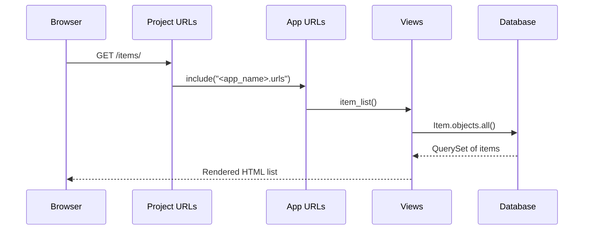

# Issue 7 – Show Your Data on the Page

This issue teaches you how to **take data from your Django database and display it on a real web page**.  
You will also learn how to **create your Issue 7 branch**, **commit your work**, and **open a Pull Request** so the Quest checker can run.

This version includes beginner explanations, notes, diagrams, and clear commands.

---

## 🧭 What You Have So Far

You already built:

- A Django project
- An app
- A model (`Item`)
- Migrations & database
- A superuser & working admin panel

Now you will:

- Add sample data  
- Query your model in a view  
- Render it on a webpage using a template  
- Use a new Issue 7 branch that the checker can detect  

---

# 🔄 0. Update `main` and Create Your Issue 7 Branch

Before starting any issue, always create a fresh branch so the automated checker knows what you are working on.

```bash
git checkout main
git pull origin main
git checkout -b issue-7-show-data
```

> 💡 Your branch **must** start with `issue-7-`  
> This lets the Quest checker detect which issue you are completing.

---

# 📊 Diagram: What You Will Build

```
Browser
   ↓
 /items/ URL
   ↓
App URL patterns
   ↓
item_list view
   ↓
Database query (Item.objects.all())
   ↓
Template renders HTML
   ↓
Browser displays list of items ✔
```

---

# ✅ 1. Add Some Data From the Admin Panel

We need real data first so we can show it on the page.

1. Start your server:
   ```bash
   python manage.py runserver
   ```

2. Open the admin:
   ```
   http://127.0.0.1:8000/admin/
   ```

3. Log in using your superuser details.

4. Look for your **Item** model (or whatever model you created).

5. Click **Add** → Create 2–3 items.

> 🎓 **Note:**  
> You can add as many as you want. These will appear on your website later!

---

# ✅ 2. Create a View That Queries the Database

Open:

```
<app_name>/views.py
```

Add:

```python
from django.shortcuts import render
from .models import Item

def item_list(request):
    items = Item.objects.all()  # get all rows from the database
    return render(request, "<app_name>/item_list.html", {"items": items})
```

### 🧠 What’s happening?

- `Item.objects.all()` asks Django for **every row** in the Item table.
- `render()` sends them into a template called `item_list.html`.
- The template will loop over the items and display them.

---

## 🧩 Diagram: How the View Works

```
item_list view
      │
      ├── Item.objects.all()  → Get all items from database
      │
      └── render(..., {"items": items})
                    │
                    ▼
            Pass items → template
```

---

# ✅ 3. Add a URL for the New View

Open:

```
<app_name>/urls.py
```

Add the new pattern:

```python
from django.urls import path
from . import views

urlpatterns = [
    path("", views.home, name="home"),
    path("items/", views.item_list, name="item_list"),
]
```

Now visiting:

```
/items/
```

will run the `item_list` view.

---

## 🌐 URL Flow Diagram



---

### 1. Browser → Project URLs  
You visit `/items/`. Django looks at `<project_name>/urls.py`.

### 2. Project URLs → App URLs  
Your project file includes your app’s URLs:

```python
path("", include("<app_name>.urls"))
```

### 3. App URLs → View  
Your app decides:

```python
path("items/", views.item_list)
```

This tells Django to run the function.

### 4. View → Database  
`Item.objects.all()` fetches the data.

### 5. View → Template → Browser  
You send the result to a template, and Django renders it.

---

# ✅ 4. Create a Template to Display Your Data

Create the correct folder structure:

```
<app_name>/
  templates/
    <app_name>/
      item_list.html
```

> 💡 If your app is called `main`, this becomes:  
> `main/templates/main/item_list.html`

Now create `item_list.html`:

```html
<!DOCTYPE html>
<html lang="en">
  <head>
    <meta charset="UTF-8" />
    <title>Items</title>
  </head>
  <body>
    <h1>Items</h1>

    
      <ul>
        
          <li>{{ item.name }}</li>
        
      </ul>
    
      <p>No items found yet.</p>
    
  </body>
</html>
```

---

## 🎓 Notes

- `` loops through each database row.
- `{{ item.name }}` prints the name of each item.
- `` checks if the database has any items.

---

# 🖥️ 5. Test It

Start your server if it's not already running:

```bash
python manage.py runserver
```

Visit:

```
http://127.0.0.1:8000/items/
```

You should now see all your database entries listed on a webpage! 🎉

---

# 🔐 6. Commit and Push Your Changes

Add all your new files:

```bash
git add .
```

Commit your work:

```bash
git commit -m "Issue 7 – Show items on a web page"
```

Push your branch:

```bash
git push -u origin issue-7-show-data
```

---

# 🚀 7. Open a Pull Request

1. Go to your GitHub repo.  
2. You will see a notification offering to create a Pull Request for your new branch.  
3. Open a PR **into `main`**.  
4. Title it:

```
Issue 7 – Show Your Data on the Page
```

5. Submit the PR and wait for the checker to run.

---

# 📝 Summary

### In this issue you learned:

- How to create and show database items
- How Django uses URLs → views → templates
- How to loop through data in a template
- How to keep work in a clean Git branch
- How to push changes and submit a Pull Request

### You now have:

- Dynamic data from the database  
- Displayed on a real page  
- Automatically updated when you add/edit/delete items  
- A PR ready for the automated checker 🎉

Great job — you’ve just made your app *come alive*! 🚀
