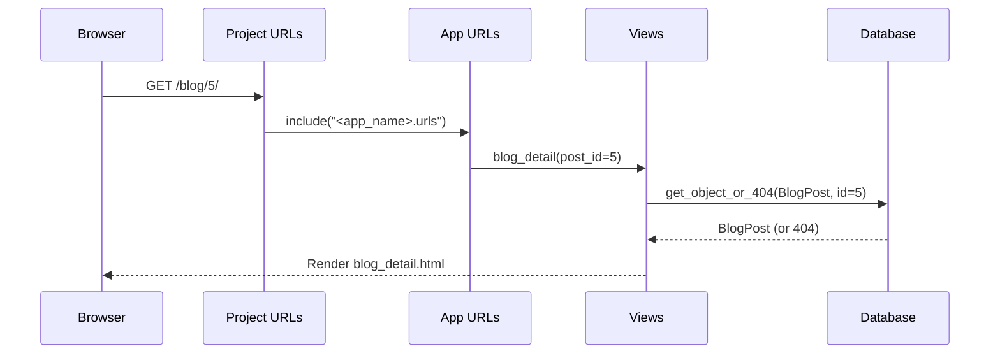

# 📰 Issue 8 – Add a Blog Post Detail Page

In this issue, you will make each blog post clickable so it opens on **its own page** with a dynamic URL like:

```
http://127.0.0.1:8000/blog/3/
```

You can follow the **BlogPost** example below, or adapt it to any model you created.

---

## 🧭 Prerequisites

Before starting Issue 8, you should already have:

- A `BlogPost` model  
- A working list page at `/blog/`  
- A template `blog_list.html` with links like:

```django
<a href="">
  {{ post.title }}
</a>
```

---

# 🔄 0. Update `main` and Create Your Issue 8 Branch

```bash
git checkout main
git pull origin main
git checkout -b issue-8-blog-detail
```

> Your branch **must** start with `issue-8-` for the automated checker to detect this issue.

---

# 📊 Diagram: What You Are Building

```
Browser
   ↓
 /blog/3/
   ↓
App URLs (blog/<int:post_id>/)
   ↓
blog_detail view
   ↓
get_object_or_404(BlogPost, id=post_id)
   ↓
Render blog_detail.html
   ↓
Browser shows the full post ✔
```

---

# ✅ 1. Create the Detail View

Open:

```
<app_name>/views.py
```

Add the import:

```python
from django.shortcuts import get_object_or_404
```

Then add the detail view:

```python
def blog_detail(request, post_id):
    # Fetch the specific BlogPost by ID or return a 404 page if not found.
    post = get_object_or_404(BlogPost, id=post_id)

    context = {"post": post}

    return render(request, "<app_name>/blog_detail.html", context)
```

### 🧠 Why `get_object_or_404`?

- Safe way to fetch an object  
- Returns a friendly “Page Not Found” instead of crashing your server  
- Automatically raises a 404 if the ID does not exist  

---

# 🧩 Detail View Diagram

```
blog_detail(request, post_id)
        │
        ├── get_object_or_404(BlogPost, id=post_id)
        │       ├── Found → return BlogPost
        │       └── Not found → return 404
        │
        └── render blog_detail.html with {"post": post}
```

---

# ✅ 2. Add the Dynamic URL Pattern

Open:

```
<app_name>/urls.py
```

Add the detail URL:

```python
urlpatterns = [
    path("", views.home, name="home"),
    path("blog/", views.blog_list, name="blog_list"),
    path("blog/<int:post_id>/", views.blog_detail, name="blog_detail"),
]
```

### 🧩 How Dynamic URLs Work

- `<int:post_id>` captures a number from the URL  
- Sends it into the view as the argument `post_id`  
- Example:  

```
/blog/5/ → blog_detail(request, post_id=5)
```

---

# 🌐 URL Flow Diagram



---

# ✅ 3. Create the Detail Template

Create the file:

```
<app_name>/templates/<app_name>/blog_detail.html
```

Add:

```html
<!DOCTYPE html>
<html lang="en">
  <head>
    <meta charset="UTF-8" />
    <title>{{ post.title }}</title>
  </head>
  <body>
    <p><a href="">← Back to all posts</a></p>

    <article>
      <h1>{{ post.title }}</h1>

      <p>
        <em>Published: {{ post.created_at|date:"F j, Y, H:i" }}</em>
      </p>

      <p>{{ post.content }}</p>
    </article>
  </body>
</html>
```

### 🎓 Notes

- `{{ post.title }}` → prints the post title  
- `{{ post.created_at|date:"F j, Y, H:i" }}` → formats the timestamp  
- `{{ post.content }}` → prints full content  
- `` → link back to summary page  

---

# 🔄 4. Confirm Everything Works

Start your server:

```bash
python manage.py runserver
```

1. Visit:

```
http://127.0.0.1:8000/blog/
```

2. Click any post title  
3. You should go to:

```
/blog/<id>/
```

Example:

```
/blog/1/
/blog/3/
```

You should see:

- Title  
- Published date  
- Full content  
- A back link  

---

# 🔐 5. Commit and Push Your Work

```bash
git add .
git commit -m "Issue 8 – Add blog post detail page"
git push -u origin issue-8-blog-detail
```

---

# 🚀 6. Open a Pull Request

1. Open GitHub  
2. Create a PR from your branch → `main`  
3. Title it:

```
Issue 8 – Add a Blog Post Detail Page
```

4. Submit the PR  
5. Wait for the automated checker  
6. Once CI passes: **merge the PR and close the issue**  

---

<details>
<summary><strong>📌 How to Close This Issue (Required)</strong></summary>

1. Open the **Issues** tab  
2. Select this issue  
3. Click **Close issue**  
4. Wait a few seconds for the next Quest issue to appear  

> ⚠️ Closing the PR is NOT enough — you must close the issue itself.
</details>

---

# 📝 Summary

### You learned:

- How to create a **detail view**  
- How to fetch an object safely with `get_object_or_404`  
- How Django handles **dynamic URLs**  
- How a list page connects to a detail page  

### You now have:

- `/blog/` → list of all posts  
- `/blog/<id>/` → full post detail page  
- A complete blog flow 🎉  

Your blog now behaves like a real application — great work! 🚀
