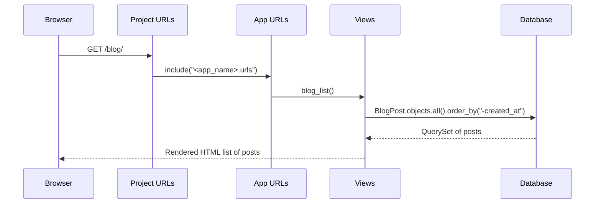

# Issue 8 – Show Blog Posts on a Page (List View)

In this issue, you’ll take the `BlogPost` model you already created and **show all posts on a normal web page** (not just in the admin).

You will:

- Create a **list view** function in `views.py`
- Add a **URL pattern** for `/blog/`
- Build a **template** that loops over posts
- Use an **Issue 8 branch** so the Quest checker can detect your work
- Commit, push, and open a Pull Request

This version includes beginner explanations, concepts, and diagrams.

---

## 🧭 What You Should Have Before Starting

From previous issues, you should already have:

- A Django project and app
- A `BlogPost` model (e.g. with `title`, `content`, `created_at`, etc.)
- Migrations applied (`python manage.py migrate`)
- Some posts created in the admin panel

If you haven’t created any blog posts yet, you’ll still be able to complete this issue — you’ll just see the “no posts yet” message.

---

# 🔄 0. Update `main` and Create Your Issue 8 Branch

Always start a new issue by creating a fresh branch from the latest `main`.

```bash
git checkout main
git pull origin main
git checkout -b issue-8-blog-list
```

> 💡 Your branch **must** start with `issue-8-`  
> This lets the Quest checker detect that you are working on **Issue 8**.

---

# 📊 Diagram: What You Will Build

You will connect the browser, URL, view, database and template like this:

```text
Browser
   ↓
 /blog/ URL
   ↓
App URL patterns
   ↓
blog_list view
   ↓
BlogPost.objects.all().order_by("-created_at")
   ↓
Template renders HTML
   ↓
Browser shows list of blog posts ✔
```

---

# ✅ 1. Create the List View

Open:

```text
<app_name>/views.py
```

Below your `home` view, add:

```python
from django.shortcuts import render
from .models import BlogPost

def blog_list(request):
    # Show a list of all blog posts.
    posts = BlogPost.objects.all().order_by("-created_at")
    # 'objects' is the model manager. '.all()' returns a QuerySet (like a list from the DB).
    # '.order_by("-created_at")' sorts newest first.

    context = {
        "posts": posts,
    }

    return render(request, "<app_name>/blog_list.html", context)
```

### 🧠 Concepts: What’s Going On Here?

- `BlogPost.objects` → the **manager** that lets you ask the database for BlogPost rows.
- `.all()` → “Give me **all** the rows in the `blogpost` table”.
- `.order_by("-created_at")` → sort by `created_at` in **descending** order (newest first).  
  - The `-` sign means “reverse order”.
- `context` → a **dictionary** that maps names (like `"posts"`) to Python objects.
- `render(request, template_name, context)`:
  - Loads the template (`"<app_name>/blog_list.html"`)
  - Passes `context` into it
  - Returns an `HttpResponse` that the browser can display.

---

## 🧩 Diagram: How the List View Works

```text
blog_list view
      │
      ├── BlogPost.objects.all().order_by("-created_at")
      │          │
      │          └─ Ask database for all posts, newest first
      │
      └── render(request, "<app_name>/blog_list.html", {"posts": posts})
                         │
                         ▼
                 Pass posts → template
```

---

# ✅ 2. Add a URL Pattern for the List View

Open:

```text
<app_name>/urls.py
```

Update it so it looks like this (you can keep any other patterns you already have):

```python
from django.urls import path
from . import views

urlpatterns = [
    path("", views.home, name="home"),
    path("blog/", views.blog_list, name="blog_list"),
]
```

Now:

- `/` → `home` view
- `/blog/` → `blog_list` view

---

## 🌐 URL Flow Diagram



---

# ✅ 3. Create the Template for the Blog List

Create the folder structure (if you haven’t already):

```text
<app_name>/
└── templates/
    └── <app_name>/
        └── blog_list.html
```

So the full path is:

```text
<app_name>/templates/<app_name>/blog_list.html
```

> 💡 Example:  
> If your app is called `blog`, you’d have:  
> `blog/templates/blog/blog_list.html`

Now edit `blog_list.html`:

```html
<!DOCTYPE html>
<html lang="en">
  <head>
    <meta charset="UTF-8" />
    <title>Blog Posts</title>
  </head>
  <body>
    <h1>Blog Posts</h1>

    
      
        <article>
          <h2>
            <a href="">
              {{ post.title }}
            </a>
          </h2>
          <p><em>Published: {{ post.created_at|date:"F j, Y" }}</em></p>
          <p>{{ post.content|truncatechars:150 }}</p>
          <hr />
        </article>
      
    
      <p>No posts yet. Log into the admin and create one.</p>
    
  </body>
</html>
```

---

## 🎓 Template Concepts

- `` → loops over the `posts` list that you passed from the view.
- `{{ post.title }}` → prints the `title` field of each `BlogPost`.
- `{{ post.content|truncatechars:150 }}` → uses the `truncatechars` **filter** to shorten long content.
- `` → checks if there are any posts at all.

> 🧠 Note: This template is already preparing for a **detail page** by linking to  
> ``. You’ll build that view and template in **Issue 9**.

---

# 🖥️ 4. Test the Blog List Page

Make sure your Django server is running:

```bash
python manage.py runserver
```

Then visit:

```text
http://127.0.0.1:8000/blog/
```

You should now see:

- A list of blog posts (if you created some in the admin), or
- A message telling you there are no posts yet.

---

# 🔐 5. Commit and Push Your Changes

Add your changes:

```bash
git add .
```

Commit them:

```bash
git commit -m "Issue 8 – Show blog posts on list page"
```

Push the branch:

```bash
git push -u origin issue-8-blog-list
```

---

# 🚀 6. Open a Pull Request

1. Go to your GitHub repo in the browser.  
2. You should see a banner suggesting you create a Pull Request from `issue-8-blog-list`.  
3. Open a PR **into `main`**.  
4. Use this title:

```text
Issue 8 – Show Blog Posts on a Page (List View)
```

5. Create the PR and let the Quest checker run.

6. Merge the PR & close this issue

When CI is green:
- Merge the PR.
- Close this Issue.

Closing this issue (labelled `issue-8`) will automatically open **Issue 9**.

<details>
<summary><strong>📌 How to Close This Issue (and Unlock the Next One)</strong></summary>

When your pull request has been **successfully merged**, you must **close this issue manually** to trigger the next Quest.

### ✅ Steps to Close the Issue

1. Open your repository on GitHub  
2. Click the **Issues** tab  
3. Open the issue you just completed  
4. Scroll down and click **Close issue**  
5. Wait a few seconds — the **next Quest issue will be created automatically**

> ⚠️ **Important:**  
> Merging the pull request is **not enough**.  
> You *must* close the issue yourself for the next Quest to appear.

</details>

---

# 📝 Summary

### In this issue you learned:

- How to write a **list view** that queries the database.
- How to sort results using `.order_by("-created_at")`.
- How to pass a `QuerySet` to a template with a **context dictionary**.
- How to loop over `posts` in a Django template.

### You now have:

- A working `/blog/` page.
- A list of blog posts shown in the browser.
- Links that will later point to detailed post pages (Issue 9).
- A PR ready for the automated checker. 🎉

You’ve just turned your blog into a **real page of content** that users can read! 🚀
