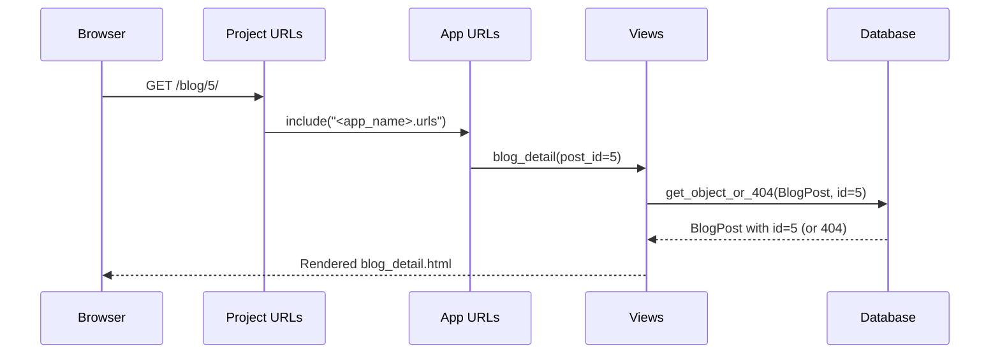

# Issue 9 – Add a Blog Post Detail Page

In this issue, you’ll extend your blog so that each post has its **own page**.

You will:

- Add a **detail view** that shows a single `BlogPost`
- Use `get_object_or_404` to safely fetch posts
- Add a **dynamic URL** like `/blog/3/`
- Create a **detail template**
- Link from the list page to the detail page
- Work in an Issue 9 branch and open a Pull Request

---

## 🧭 What You Should Have Before Starting

From **Issue 8**, you should already have:

- A `BlogPost` model
- A `blog_list` view
- `/blog/` showing all posts
- A template `blog_list.html` with links like:

```django
<a href="">
  {{ post.title }}
</a>
```

---

# 🔄 0. Update `main` and Create Your Issue 9 Branch

Start from your latest `main` branch:

```bash
git checkout main
git pull origin main
git checkout -b issue-9-blog-detail
```

> 💡 Your branch **must** start with `issue-9-`  
> This lets the Quest checker detect that you are working on **Issue 9**.

---

# 📊 Diagram: What You Will Build

You’re going to support two URLs:

- `/blog/` → list of all posts
- `/blog/3/` → the **detail page** for the post with ID `3`

Flow for the detail page:

```text
Browser
   ↓
 /blog/3/ URL
   ↓
App URL patterns (blog/<int:post_id>/)
   ↓
blog_detail view
   ↓
get_object_or_404(BlogPost, id=post_id)
   ↓
Template renders blog_detail.html
   ↓
Browser shows full post ✔
```

---

# ✅ 1. Create the Detail View

Open:

```text
<app_name>/views.py
```

At the top (with your other imports), add:

```python
from django.shortcuts import get_object_or_404
```

Then add the new view:

```python
def blog_detail(request, post_id):
    # Show a single blog post.
    # 'post_id' comes from the URL.
    post = get_object_or_404(BlogPost, id=post_id)
    # get_object_or_404 tries to find the BlogPost with this id.
    # If not found, it returns a 404 page automatically.

    context = {
        "post": post,
    }

    return render(request, "<app_name>/blog_detail.html", context)
```

---

## 🧠 Concepts: `get_object_or_404` and URL Parameters

- `post_id` is a **function parameter** on `blog_detail`.
- Django fills in `post_id` using the value captured from the URL (you’ll set this up in the URL pattern).
- `get_object_or_404(BlogPost, id=post_id)`:

  - Runs a query like: “Find the `BlogPost` with primary key / id = `post_id`”
  - If found → returns the object
  - If not found → returns a **404 page** instead of crashing your app

This is safer than doing:

```python
post = BlogPost.objects.get(id=post_id)
```

because `.get()` will raise an exception if there’s no match.

---

## 🧩 Detail View Diagram

```text
blog_detail(request, post_id)
        │
        ├── get_object_or_404(BlogPost, id=post_id)
        │       │
        │       └─ If found → BlogPost object
        │          If not → 404 response
        │
        └── render(request, "<app_name>/blog_detail.html", {"post": post})
                           │
                           ▼
                    Pass post → template
```

---

# ✅ 2. Add the URL Pattern for the Detail View

Open:

```text
<app_name>/urls.py
```

Update your URL patterns so they include the detail route:

```python
from django.urls import path
from . import views

urlpatterns = [
    path("", views.home, name="home"),
    path("blog/", views.blog_list, name="blog_list"),
    path("blog/<int:post_id>/", views.blog_detail, name="blog_detail"),
]
```

### 🧠 Concepts: Dynamic URLs and Path Converters

- `"blog/<int:post_id>/"` is a **dynamic URL pattern**.
- `<int:post_id>` is a **path converter**:
  - It says: “capture an integer from this part of the URL”
  - Store it in a variable called `post_id`
  - Pass it to the view function as the `post_id` argument

Example:

- URL `/blog/5/` → Django calls `blog_detail(request, post_id=5)`

---

## 🌐 URL Flow Diagram



---

# ✅ 3. Create the Detail Template

Create the file:

```text
<app_name>/templates/<app_name>/blog_detail.html
```

Add:

```html
<!DOCTYPE html>
<html lang="en">
  <head>
    <meta charset="UTF-8" />
    <title>{{ post.title }}</title>
  </head>
  <body>
    <p><a href="">← Back to all posts</a></p>

    <article>
      <h1>{{ post.title }}</h1>
      <p>
        <em>
          Published: {{ post.created_at|date:"F j, Y, H:i" }}
        </em>
      </p>
      <p>{{ post.content }}</p>
    </article>
  </body>
</html>
```

---

## 🎓 Template Concepts

- `{{ post.title }}` → uses the `post` object passed in from the view.
- `{{ post.created_at|date:"F j, Y, H:i" }}` → uses the `date` filter to format the datetime.
- `{{ post.content }}` → prints the full content.
- `` → uses the `name="blog_list"` URL so that the “Back to all posts” link goes to `/blog/`.

---

# 🔄 4. Confirm the Full Flow

1. Make sure your server is running:

   ```bash
   python manage.py runserver
   ```

2. Visit the list page:

   ```text
   http://127.0.0.1:8000/blog/
   ```

3. Click on a post title.

   - The link in `blog_list.html`:

     ```django
     <a href="">
       {{ post.title }}
     </a>
     ```

   - Should take you to:

     ```text
     /blog/<id>/
     ```

     for that post (e.g. `/blog/1/`, `/blog/5/`).

4. On the detail page you should see:

   - Full title
   - Published date
   - Full content
   - A link to go back to the list

---

# 🔐 5. Commit and Push Your Changes

Stage your changes:

```bash
git add .
```

Commit them:

```bash
git commit -m "Issue 9 – Add blog post detail page"
```

Push the branch:

```bash
git push -u origin issue-9-blog-detail
```

---

# 🚀 6. Open a Pull Request

1. Go to your GitHub repo in the browser.  
2. You should see a banner suggesting you create a Pull Request from `issue-9-blog-detail`.  
3. Open a PR **into `main`**.  
4. Use this title:

```text
Issue 9 – Add a Blog Post Detail Page
```

5. Create the PR and let the Quest checker run.

6. Merge the PR & close this issue

When CI is green:
- Merge the PR.
- Close this Issue.

Closing this issue (labelled `issue-8`) will automatically open **Issue 9**.

<details>
<summary><strong>📌 How to Close This Issue (and Unlock the Next One)</strong></summary>

When your pull request has been **successfully merged**, you must **close this issue manually** to trigger the next Quest.

### ✅ Steps to Close the Issue

1. Open your repository on GitHub  
2. Click the **Issues** tab  
3. Open the issue you just completed  
4. Scroll down and click **Close issue**  
5. Wait a few seconds — the **next Quest issue will be created automatically**

> ⚠️ **Important:**  
> Merging the pull request is **not enough**.  
> You *must* close the issue yourself for the next Quest to appear.

</details>
---

# 📝 Summary

### In this issue you learned:

- How to build a **detail view** for a single object.
- How to use `get_object_or_404` to safely fetch data.
- How to define a **dynamic URL** using `<int:post_id>`.
- How to connect list and detail pages with ``.

### You now have:

- `/blog/` → list of all blog posts.
- `/blog/<id>/` → full detail page for a single post.
- A complete blog flow: **list → detail → back to list**.
--> A fully functional blog! 🎉

Your blog now feels like a real app: users can browse posts and dive into the full story for each one! 🚀
